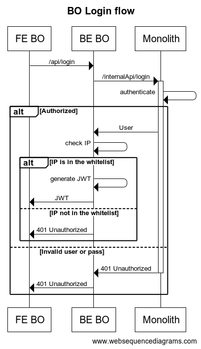

## Authentication
For authentication the application uses [JWT tokens](https://auth0.com/docs/tokens/json-web-tokens).
### Login
#### Login API
In order for a user to be authenticated a JWT token will be generated by the 
`/api/v1/users/login` API and will be sent to the frontend application.  
Request example:  
```http request
POST {HOST_NAME}/api/v1/users/login 
Accept: application/json 
Content-Type: application/json 

{ 
  username: "username",
  password: "MySecretPass!"
}
```
The response will look something like this:  
__200 Ok__
```JSON
{
  "token": "eyJ0eXAiOiJKV1QiLCJhbGciOiJSUzI1NiJ9.eyJp..."
}
```
__401 Unauthorized__
```JSON
{
  "statusCode": 401,
  "body": null,
  "error": "Invalid credentials.",
  "status": "error"
}
```
#### Decoding the JWT
Decoding the JWT will result in something similar to this
```JSON
{
  "iat": 1527026794,
  "exp": 1527027994,
  "role": "administrator",
  "user_id": 123
}
```
This JWT will be used to keep the user authenticated on subsequent requests,
by sending it under the header `X-Auth-Token`.
```http request
GET {HOST_NAME}/api/v1/fodlers
Accept: application/json 
X-Auth-Token: eyJ0eXAiOiJKV1QiLCJhbGciOiJSUzI1NiJ9.eyJpYX...
```

The JWT is set to expire the next day at 03:00AM, and it is stored in Redis with a set validity time.
Every request that is made using that JWT will reset the validity in redis storage. The value of validity is set with
an environment variable: `JWT_TTL`, the default value will be 20 minutes. Some requests mai alter the state of the JWT payload, 
that's why for those requests a refresh token is generated and stored in Redis. The new refresh token is sent in the `x-extended-token` as shown below:
```
cache-control: no-cache, private  
connection: Keep-Alive  
content-length: 329  
content-type: application/json  
...
x-extended-token: eyJ0eXAiOiJKV1QiLCJhbGciOiJSUzI1NiJ9.eyJpYX... 
...
```
#### Login flow
  
The login flow starts when the user triggers the login event which calls the [Login API](#login-api).
Internally this will call the `/internalApi/user/login` API from the [Monolith](../Monolith.md) that will try to
authenticate the user and respond with the following responses:
- __200 OK__: user and password are valid:  
    - in this case the Monolith will return the user entity. Then the app will create a JWT token, store it in Redis and the app will 
        respond with 200 OK HTTP code, and the JWT in the body of the response
      - else a 401 HTTP code will be sent back in the response
- __401 Unauthorized__: user and password are invalid.

### Logout
#### Logout API
Request example:
```http request
POST {HOST_NAME}/api/v1/users/logout 
Accept: application/json 
Content-Type: application/json
```
The response will look something like this:  
__204 No Content__  
> Note: This endpoint will remove from Redis the JWT token.
#### Logout flow
  
